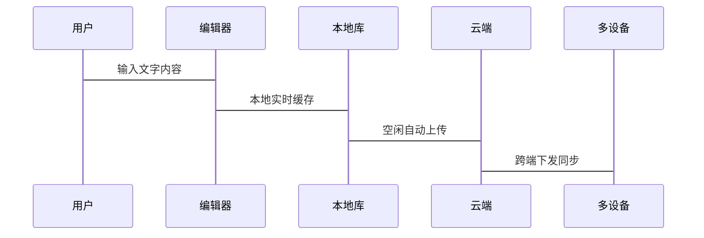
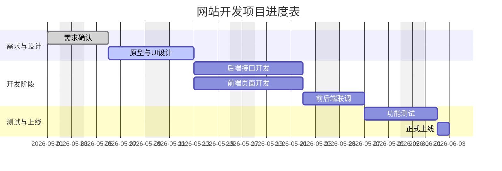
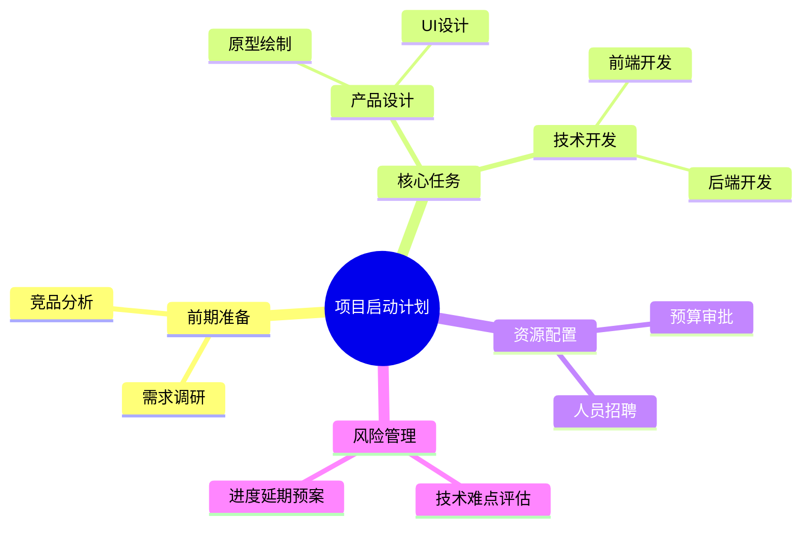

# 移动端Markdown编辑器全语法验收测试文档
> 适配手机/平板端所有标准Markdown + GFM扩展语法，无冗余、可直接用于功能测试

[TOC]

# 一、标题层级
# 一级标题
## 二级标题
### 三级标题
#### 四级标题
##### 五级标题
###### 六级标题

---

# 二、基础文本样式
**加粗文本**
*斜体文本*
***粗斜合并文本***
~~删除线文本~~
==高亮文本==
<u>下划线文本</u>
行内代码：`const md = true`

上标：$x^2$
下标：$y_1$

普通正文段落，移动端自动适配宽度，自动换行，适合日常笔记撰写。
软换行直接回车即可。

# 三、引用区块
> 单行引用内容
> 多行引用第二行

>> 二级嵌套引用
>>> 三级嵌套引用

# 四、列表语法
## 4.1 无序列表
- 基础功能项
- 快捷输入优化
  - 一级子列表
  - 二级子列表

## 4.2 有序列表
1. 新建文档
2. 编辑内容
3. 实时预览
   1. 子步骤一
   2. 子步骤二

## 4.3 GFM任务清单
- [x] 完成底部快捷工具栏
- [x] 图片插入功能
- [ ] 深色模式适配
- [ ] 全局搜索功能

# 五、分割线
---
***
___

# 六、链接全套写法
1. 基础文字链接
[Markdown教程](https://www.runoob.com)

2. 带悬浮提示链接
[点击查看详情](https://www.example.com "鼠标悬浮显示提示文字")

3. 原生自动链接
https://github.com

4. 页面锚点跳转
[返回顶部](#一标题层级)

# 七、全场景图片语法
## 7.1 基础图片


## 7.2 无描述图片


## 7.3 本地相对路径图片


## 7.4 HTML自定义宽度图片


## 7.5 居中对齐图片
<center>

</center>

## 7.6 图片嵌套超链接
[](https://www.example.com)

# 八、标准表格
## 8.1 普通表格
| 功能模块 | 开发状态 | 适配端 |
| ---- | ---- | ---- |
| 文本编辑 | 已完成 | 安卓/iOS |
| 云端同步 | 开发中 | 全平台 |
| 公式渲染 | 待优化 | 平板优先 |

## 8.2 对齐格式表格
| 左对齐内容 | 居中内容 | 右对齐内容 |
| :--- | :---: | ---: |
| 文案编辑 | 预览模式 | 导出PDF |
| 快捷按键 | 主题切换 | 历史回溯 |

# 九、代码块
## 9.1 无语言通用代码
```
移动端编辑器通用文本代码块
支持多行纯文本展示
```

## 9.2 JavaScript代码
```javascript
function mobileEditorInit() {
  let isDark = false;
  let autoSaveTime = 15;
  return { isDark, autoSaveTime };
}
```

## 9.3 Python代码
```python
def file_sync():
    print("移动端文件自动同步成功")
```

## 9.4 SQL代码
```sql
select * from note_list order by create_time desc;
```

# 十、注释与特殊标签
<!-- 这是隐藏注释，预览界面不可见 -->

键盘快捷键：<kbd>Ctrl</kbd> + <kbd>S</kbd> 快速保存

# 十一、定义列表
编辑器
: 移动端轻量化Markdown写作工具

同步服务
: 支持WebDAV、云盘双向自动同步

# 十二、脚注用法
移动端写作更加轻便高效[^note1]
[^note1]: 优化触摸交互，适配单手操作逻辑

# 十三、Emoji表情
日常笔记表情：📝 ✅ ❌ 🚀 💡 📱 🔥 ⚠️

# 十四、折叠收纳区块
<details>
<summary>点击展开查看隐藏内容</summary>
此处为折叠区域，适合存放教程步骤、备用资料、长段备注，不占用主页面排版空间。
</details>

# 十五、GitHub风格提示块
> [!NOTE]
> 基础备注：记录日常使用小知识点

> [!TIP]
> 实用技巧：左右滑动可快速切换编辑/预览模式

> [!WARNING]
> 注意提醒：未开启云同步前请手动备份文档

> [!CAUTION]
> 风险提示：清理缓存会删除本地未同步草稿

# 十六、LaTeX数学公式
行内公式：$a^2 + b^2 = c^2$

块级公式：
$$
S = \frac{1}{2}ah
$$

# 十七、Mermaid图表（修复思维导图，全部可用）
## 17.1 基础流程图


## 17.2 时序流程图


## 17.3 甘特图


## 17.4 思维导图



# 十八、转义字符测试
\#  \*  \-  \`  \[  \]  \_  \!

# 十九、混合嵌套排版
- 一级列表项
  1. 混合有序子项一
  2. 混合有序子项二
- 一级列表第二项
  - 无序列嵌套子项

# 二十、长文本滚动测试
大量填充正文内容，用于测试移动端纵向滚动流畅度、字体渲染清晰度、行高间距、夜间深色模式显示效果，适配手机竖屏全屏沉浸式编辑模式，隐藏多余UI控件，专注文字创作，同时兼容平板设备左右分栏布局，横屏自动自适应排版，满足学习笔记、工作文档、日常随笔、技术文档全部写作场景，适配双系统移动端交互逻辑。
